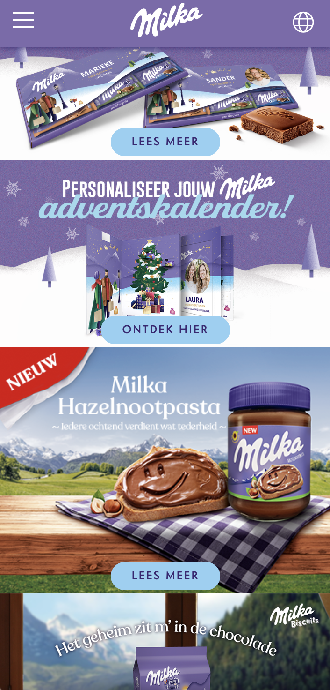

# Procesverslag
Markdown is een simpele manier om HTML te schrijven.  
Markdown cheat cheet: [Hulp bij het schrijven van Markdown](https://github.com/adam-p/markdown-here/wiki/Markdown-Cheatsheet).

Nb. De standaardstructuur en de spartaanse opmaak van de README.md zijn helemaal prima. Het gaat om de inhoud van je procesverslag. Besteedt de tijd voor pracht en praal aan je website.

Nb. Door *open* toe te voegen aan een *details* element kun je deze standaard open zetten. Fijn om dat steeds voor de relevante stuk(ken) te doen.

## Jij

  
uitwerken voor kick-off werkgroep

  ### Auteur:
  Laura Wilting

  #### Je startniveau:
  Blauw!!!!!

  #### Je focus:
  Responsive
 

## Je website

  
uitwerken voor kick-off werkgroep

  ### Je opdracht:
  website van Milka:
  https://www.milka.nl/ 

  #### Screenshot(s) van de eerste pagina (small screen): 
 
  
  

  #### Screenshot(s) van de tweede pagina (small screen):
  
  
  

 

## Toegankelijkheidstest 1/2 (week 1)

  
uitwerken na test in 1e werkgroep

  ### Bevindingen
  Ik ben er achter gekomen dat wanneer je bepaalde beperkingen hebt, het gebruiken van een website een stuk moeilijker wordt. 
  
  Zelf vond ik motoriek (de shocks) de vervelenste beperking. De groote buttons kan ik nog wel bedienen maar naar maten deze kleiner worden, wordt dit steeds moeilijker. Ik had met de screenreader toepassen op mijn gekozen website ook nog wel wat moeite. Ik vind het lastig om deze te gebruiken en moet hier nog flink mee oefenen! 

  Samen met Donna aan het testen: 

  

  #### Screenreader
  De screenreader deed het niet helemaal goed op mijn gekozen website. Hij bleef soms vast lopen en las niet alle stukjes tekst op. 
  Ik heb de twee pagina’s bekeken in Safari op Chrome en ben het volgende problemen tegengekomen:
  Het viel mij op dat veel  tags geen alt beschrijving hebben. Hierdoor weet de gebruiker niet wat er in de afbeelding wordt weergegeven.

  Hoe kan ik dit oplossen? 

  Door alle afbeeldingen een duidelijke alt beschrijving te geven, zijn de visuele elementen een stuk beter te begrijpen via een screenreader.

  #### Muis en Toetsenbord 
  De muis en toetsenbord reageeren goed op mijn site. De pijltjes van boven naar beneden doen het ook goed. Ik kan alleen niet van links en naar rechts gewegen op de website of van links naar rechts via de buttons.

  Hier een omschrijving van hoe het opgelost kan worden (met indien nodig afbeeldingen)

  #### Motoriek (shocks, elastiekjes)
  De website maakt gebruik van redelijk groote buttons, hierdoor kan je nog redelijke goed navigeren door de website. 
  Echter gebruikt Milka hele kleine linkjes in de footer en navigatiebar. Door de shocken kon ik niet op deze linkjes clicken. 
  
  Hoe kan ik dit oplossen? 

  Ik ga de linkjes en kopjes in de footer en navigatiebar wat grooter maken. Hierdoor maak ik mijn website toegangelijker voor mensen met deze beperking. 

  

  

  #### Visueel (brillen, contrast, kleurenblind, dark/light). 
  De kleuren van de website beleef ik heel anders in de kleurenblind functies: 

  
  

  Hoe kan ik dit oplossen?

  De kleuren van de chocolade komen helemaal niet lekker en uitnodigend over in de kleurenblind functies. Daarom wil ik graag een darkmodus toepassen op mijn website. Hierdoor komt chocolade nog wel goed uit: 

## Breakdownschets (week 1)

  
uitwerken na afloop 2e werkgroep

  ### de hele pagina: 
  

  ### dynamisch deel (bijv menu): 
  

  ### wellicht nog een dynamisch deel (bijv filter): 
  

## Voortgang 1 (week 2)

  
uitwerken voor 1e voortgang

  ### Stand van zaken
 Ik heb nu bijna al mijn html geschreven en alle plaatjes verwerkt. Dit ging goed en met html schrijen heb ik niet zo veel problemen. CSS en JS daarin tegen vind ik een stuk lastiger. Hier ben ik dan ook nog een beetje bang voor. 
 Ik vind het last om te bepalen waar ik moet beginnen. 

 Ik probeer zometeen een begin te maken met het stylen van mijn eerste pagina. Hoop dat dit een beetje oke gaat, anders kan ik morgen hulp vragen in de les.

  ### Agenda voor meeting
  samen met je groepje opstellen

  | Laura          |  Youri             | Pepijn       | student 4        |
  | ---            | ---                | ---          | ---              |
  | Ik wil graag   |  Youri wil graag   | Pepijn wil                                 
  | weten waar ik  |  weten hoe zijn    | Weten of zijn 
  | het beste mee  |  header het beste  | html semantisch 
  | kan beginnen   |  kan laten werken. | genoeg is.
  |in mijn CSS. 
 

  ### Verslag van meeting
  hier na afloop snel de uitkomsten van de meeting vastleggen

  - We kunnen elkaar lastig op weg helpen via deze manier en willen elkaar daarom graag morgen in de les helpen. 
  - Hulp vragen aan de docent en de student assisenten.

  Feedback na meeting met docent: 

  - Jullie gaan de goede kant op. Probeer eerst te foccusen op alle content en daarna de vormgeving. Werk stap voor stap.

  

## Voortgang 2 (week 3)

  
uitwerken voor 2e voortgang

  ### Stand van zaken
  Ik ben aardig op weg met de eerste pagina van mijn website. Dit gaat redelijk goed! mijn CSS heb ik helemaal netjes gemaakt. 
  Ik loop helaas vast bij mijn footer: 

  

  Gefixt!!!: 

  

  ### Agenda voor meeting
  samen met je groepje opstellen

  | Laura          |  Youri             | Pepijn     
  | ---            | ---                | ---         
  | Ik wil graag   |  heeft geen vragen | Pepijn wil                                 
  | aan de slag met|  weten hoe zijn    | Weten wat hij  
  | mijn footer.   |  header het beste  | moet toevoegen 
  |                |  kan laten werken. | om zijn website toegangelijk te maken 
  

Laura: Ik wil graag aan de slag met mijn footer. Ik loop bij dit onderdeel vast. 
Pepijn: Wat je extra wit toevoegen qua toegankelijkheid. 
Youri: Heeft geen vragen! 

  ### Verslag van meeting
  hier na afloop snel de uitkomsten van de meeting vastleggen

  - De meeting ging goed en we hebben elkaat zelfs een beetje kunnen helpen. 
  - Youri had geen vragen dus met hem heb ik niet echt gesproken. 
  - 

## Toegankelijkheidstest 2/2 (week 4)

  
uitwerken na test in 8e werkgroep

  ### Bevindingen
  Lijst met je bevindingen die in de test naar voren kwamen (geef ook aan wat er verbeterd is):

  Ik ben er achter gekomen dat de website die ik na maak niet voorzien is van een darkmodus. 
  Dit wil ik dus wel coderen in mijn eigen website. 

  De kleurtjes op mijn eigen website doen het niet. Op de officele website werkt dit wel. Dit ga ik dus nog aanpassen. 

  

  #### Screenreader
  Hier korte omschrijving (met indien nodig afbeeldingen)
  De screenreader loopt goed op mijn website en hij leest alles goed voor. 

  Hier een omschrijving van hoe het opgelost kan worden (met indien nodig afbeeldingen)

  #### Muis en Toetsenbord 
  Hier korte omschrijving (met indien nodig afbeeldingen)
  De muis en het toetsenbord werken goed op mijn gecodeerde website. De pijltjes en tab toets gaan door de navigatie bar en footer heen. Verder heb ik geen knopjes op mijn website. 

  Hier een omschrijving van hoe het opgelost kan worden (met indien nodig afbeeldingen)

  #### Motoriek (shocks, elastiekjes)
  Hier korte omschrijving (met indien nodig afbeeldingen)

  Mijn website is goed te bedienen met de shocken. Dit komt omdat ik gebruik maak van vrij groote knoppen en buttons. 
  De navbar was iets moeilijker te gebruiken.

  Hier een omschrijving van hoe het opgelost kan worden (met indien nodig afbeeldingen)
  Ik heb het lettertype in de navnbar een stuk grooter gemaakt. Hierdoor is de navbar ook goed in gebruik. 

  #### Visueel (brillen, contrast, kleurenblind, dark/light). 
  Hier korte omschrijving (met indien nodig afbeeldingen)

  Met de brillen is mijn site redelijk goed zichbaar. Ik maak gebruik van een duidelijk kleuren contrast en de afbeelding zijn erg groot. 

  Als ik mij website op de kleurenblind opties zet wordt de kleur van de chocolade heel vies. de bruine chocolade reep kleurt bijvoorbeeld groen. 

  Hier een omschrijving van hoe het opgelost kan worden (met indien nodig afbeeldingen)

  Ik wil graag een optie voor alleen de darkmode maken. Hierdoor komt de kleur van de chocola veel mooier over. 

screenshot van mijn site met kleurenblind beperking: 
 

screenshot van mijn op zwart-wit filter beperking, hierdoor komen mijn foto's veel mooier over : 
 

## Voortgang 3 (week 4)

  
uitwerken voor 3e voortgang

  ### Stand van zaken
  Het is mij gelukt mijn tweede pagina af te krijgen. Altans.. ik heb alle content die ik erin wilde, erin staan! Ik heb de afbeeldingen en buttons naast elkaar gezet en heb een nav bar gemaakt. Alles moet nu nog een plekje krijgen..

  waar ik nog aan moet werken: 

  Ik zou graag willen dat mijn nav bar pas zichtbaar wordt als ik naar beneden scrol. Nu zie je hem al meteen als ik de pagina open.
  Ook heb ik moeite met mijn footer. Ik weet niet zo goed hoe ik het voor elkaar krijg dat mijn footer er het zelfde uitziet als op de offiecele website.

  screenshot van hoe mijn footer er nu uitziet..: 

  

  ### Agenda voor meeting
  samen met je groepje opstellen

  | Laura          | Pepijn             | Youri        
  | ---            | ---                | ---          
  | Hulp bij nav   | was niet bij       | hulp bij     
  | bar en footer  | meeting            | bling bling  
  |                | ...                | toevoegen aan website.    

  ### Verslag van meeting
  hier na afloop snel de uitkomsten van de meeting vastleggen

  - Meeting ging goed. Ik was alleen met Youri.
  - Youi en ik konden elkaar niet verder helpen, omdat we niet wisten hoe we elkaars problemen konden oplossen. 
 

## Eindgesprek (week 5)

  
uitwerken voor eindgesprek

  ### Je uitkomst - karakteristiek screenshots:
  

  ### Dit ging goed/Heb ik geleerd: 
  Ik heb enorm veel geleerd op het gebied van CSS. Ik snap nu wel echt wat ik doe (over het algmeen hah). 
  Ook ben ik best trots op mijn hamburger menu en mijn footer. Hier heb ik wel hulp bij gekregen. 

  Ik heb voornamelijk geleerd hoe ik mijn website zo goed mogelijk responsive kan maken en dit is aardig gelukt: 
  

  
  

  ### Dit was lastig/Is niet gelukt:
  Ik had heel graag nog een dark-modus willen instaleren op mijn website omdat de afbeeldingen van de chocolade er in verschillende kleurenblind functies er een beetje vies uit kon zien.
  Ik heb hier echt nog mijn best voor gedaan, maar helaas is dit niet gelukt. Ik kwam er niet uit en merkte dat het te veek tijd in beslag nam.

  Ook ben ik lang bezig geweest en vond ik het heel lastig om mijn website responsive te maken. Dit is uiteindelijk wel gelukt. 

  

## Bronnenlijst

  
continu bijhouden terwijl je werkt

  Nb. Wees specifiek ('css-tricks' als bron is bijv. niet specifiek genoeg).

  1. bron 1
  2. bron 2
  3. ...

